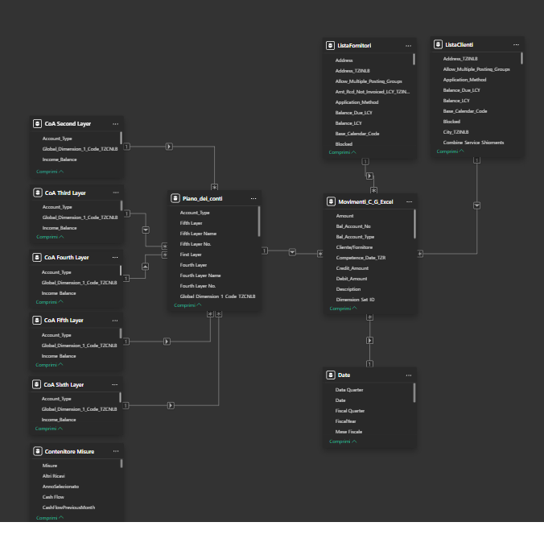
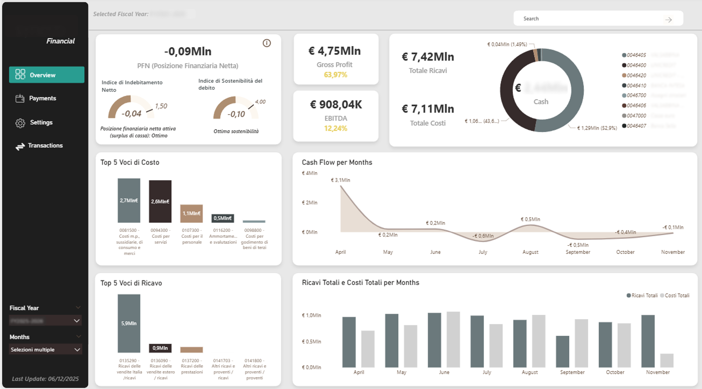

# Financial Control BI System

This system integrates financial modeling, data architecture and KPI interpretation to support real business decisions.

## Overview
This project presents a Power BI-based financial control system designed to monitor financial performance, cash flow and key management KPIs.

The solution is built on accounting data extracted from Microsoft Dynamics 365 Business Central and reorganized through a multi-layer chart of accounts to simplify financial reclassification, KPI calculation and dashboard scalability.

## Business Context
In many SMEs, financial reporting is often fragmented, manual and difficult to scale. Accounting data is available, but not always structured in a way that supports fast analysis and decision-making.

## Solution
The system transforms accounting movements into an analytical financial model through:
- a fact table based on accounting entries
- a multi-layer chart of accounts
- custom DAX measures
- interactive Power BI dashboards
- dynamic fiscal year and month filters

## Architecture

The system follows a structured data flow:

Business Central → Accounting Entries → Data Model → Multi-layer Chart of Accounts → DAX Measures → Power BI Dashboard

## Data Model Schema

## Dashboard Overview

### Key Design Principles

- Centralized fact table based on accounting movements
- Multi-layer chart of accounts for flexible financial reclassification
- Separation between raw data, business logic and visualization
- Scalable model for adding new KPIs and analysis views

## Data Model
The relational model is centered on the accounting movements fact table.

Main entities:
- Accounting entries
- Chart of accounts
- Multi-level account hierarchy
- Date table
- Customer and supplier dimensions

The chart of accounts was reorganized into multiple layers to support:
- financial statement reclassification
- cost and revenue aggregation
- KPI calculation
- scalable reporting logic

## Key Metrics
The dashboard currently includes:
- Net Financial Position
- Debt ratios
- Gross Profit
- Gross Margin
- EBITDA
- Total revenues
- Total costs
- Cash balance
- Monthly cash flow
- Top cost drivers
- Top revenue drivers
- Production value vs total costs

## Scalability
The model was designed to be easily extended with new measures, new views and additional financial analysis areas.

## Tech Stack
- Power BI
- DAX
- Microsoft Dynamics 365 Business Central
- Data modeling
- Financial controlling logic

## Business Value
The solution improves:
- visibility on financial performance
- monitoring of liquidity and profitability
- speed of financial analysis
- decision-making quality
- scalability of management reporting

## Documentation

- [Data Model Design](docs/data-model.md)
- [DAX Measures](docs/dax-measures.md)
- [Use Cases](docs/use-cases.md)
